# Projeto Linux e AWS Compass UOL 2025
Projeto em Linux com o intuito fazer um script que verifique se um site está online e notifique através do Discord/Telegram, criar uma página HTML simples e usar o NGINX para armazenar

* Etapa 1: Configuração do Ambiente
* Etapa 2: Configuração do Servidor Web
* Etapa 3: Script de Monitoramento + Webhook
* Etapa 4: Testes e Documentação


# Etapa 1: Configuração do Ambiente
1.1 - Criação da VPC
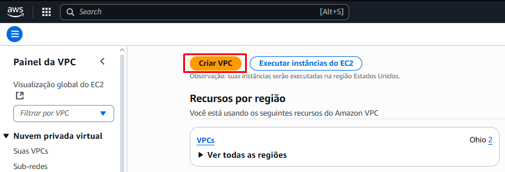

Para conseguir a configuração das 2 sub redes públicas e privadas, é necessário seguir as mesmas configurações das imagens, após, basta pressionar o botão Criar VPC
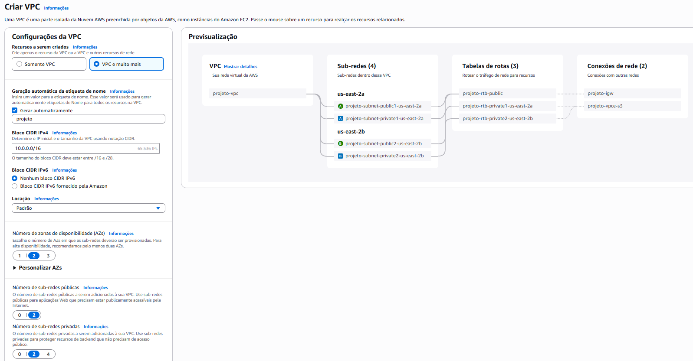
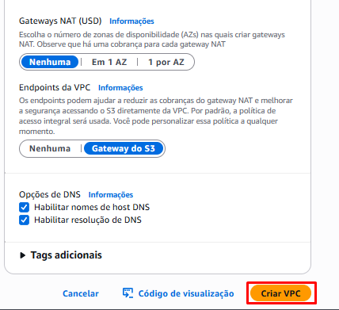
Para a criação do Gateway, basta entrar na aba de Gateway e Clicar no botão de criação
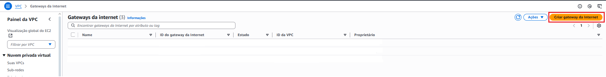

1.2 - Criação de uma instância EC2 na AWS
Basta entrar na aba EC2 e clicar no botão de executar instância
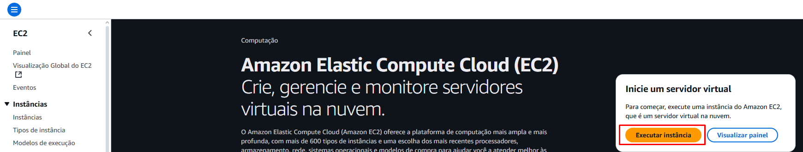

Seleciona o sistema operacional descrito na atividade
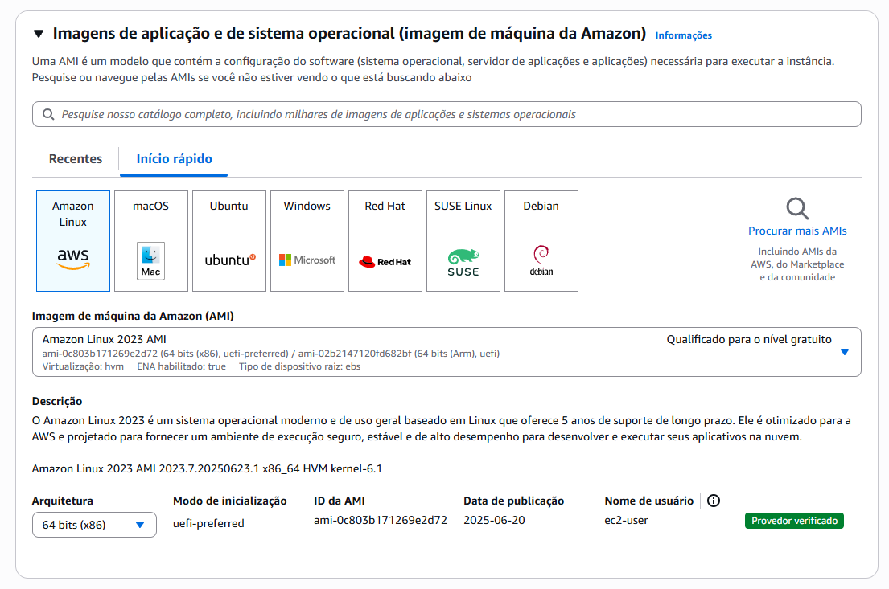

Para instalar a sub rede criada anteriormente, basta clicar no botão de editar em “Configurações de rede”
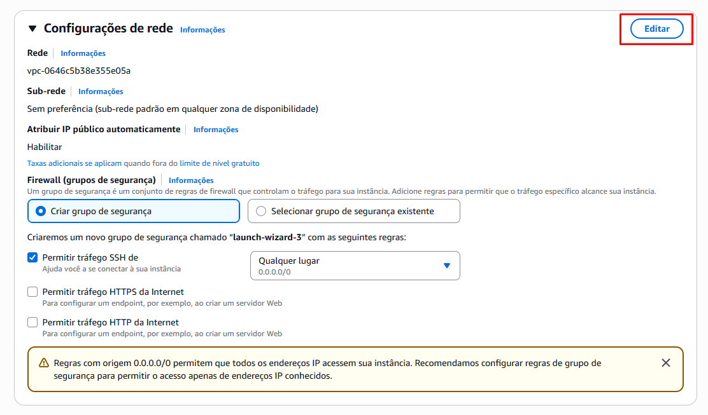
Será necessário selecionar a VPC criada, uma das sub redes públicas e atribuir IP público automaticamente
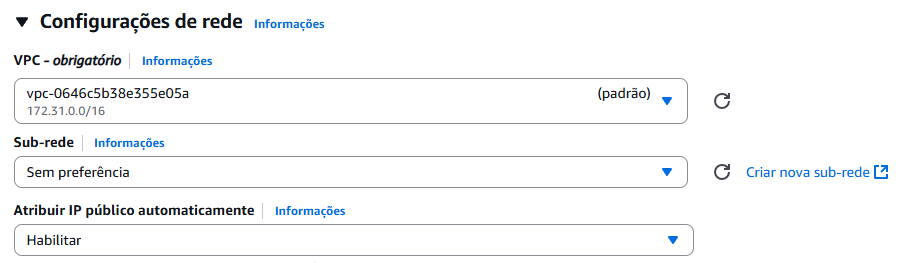

Para permitir o tráfego HTTP(80) e SSH(22) é necessário adicionar uma nova regra e configurando as duas, uma para SSH e outra para HTTP, utilize das mesmas opções da imagem.
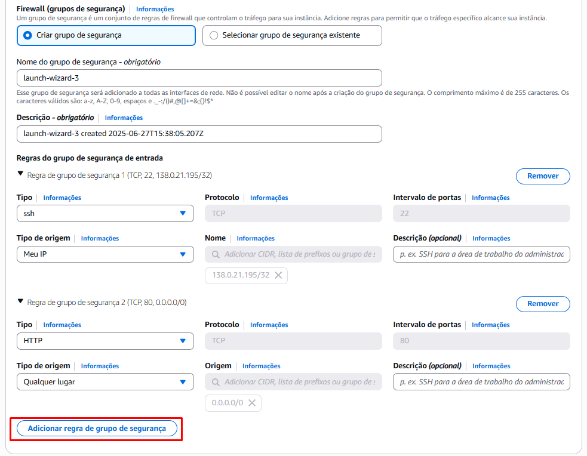


1.3 – Acessar instância via SSH
Para acessar via SSH, foi utilizado o programa PuTTY, é necessário colocar o IP atribuído a instância
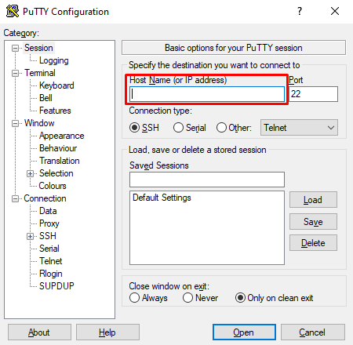

Após, é necessário navegar até a opção SSH, Auth e Credentials. Na aba Credentials, você vai clicar em Browse na primeira opção e inserir a key privada, logo, basta clicar em Open
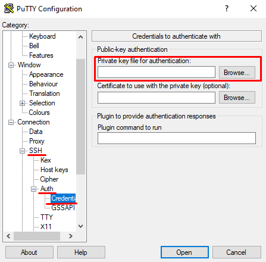


# Etapa 2: Instalação e Configuração do Servidor Web

Nessa etapa foi instalado e configurado o servidor web Nginx na máquina virtual Ubuntu 22.04. Também foi criada uma página HTML personalizada para ser servida pelo Nginx, contendo informações sobre o projeto. E foi criado um serviço systemd para garantir que o Nginx reinicie automaticamente após 3 minutos se parar.

## 1. Instalação e verificação do Nginx

### 1.1. Atualização dos pacotes do sistema

```bash
sudo apt-get update
```
### 1.2. Instalação do NGINX

```bash
sudo apt-get install nginx
```

Inicie o nginx
```bash
sudo systemctl start nginx
```
Verifique o stauts para ver se está ok
```bash
sudo systemctl status nginx
```
# 2.2 - Criar uma página HTML simples para ser exibida pelo servidor.
Criar uma nova pasta para o novo site

```bash
mkdir -p /var/www/meusite/html
```
Criar o arquivo HTML na nova pasta
```bash
nano /var/www/meusite/html/index.html
```
Coloque o seu código HTML, após isso pressione CTRL + O, ENTER e CTRL+X. Tem como objetivo salvar e sair do editor de texto.

# 2.3 - Configurar o Nginx para servir a página corretamente.
Navegue até a pasta de configurações do Nginx
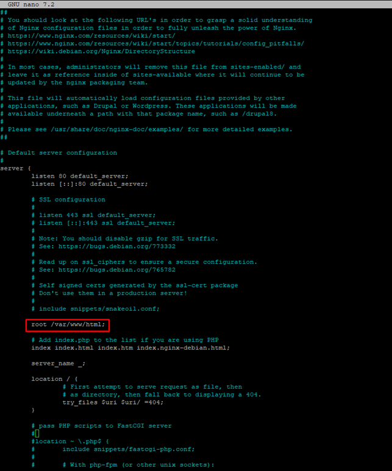
```bash
nano /etc/nginx/sites-available/default
```
Após localizar o comando root /var/www/html, altere para a pasta criada, nesse caso será  root /var/www/meusite/html
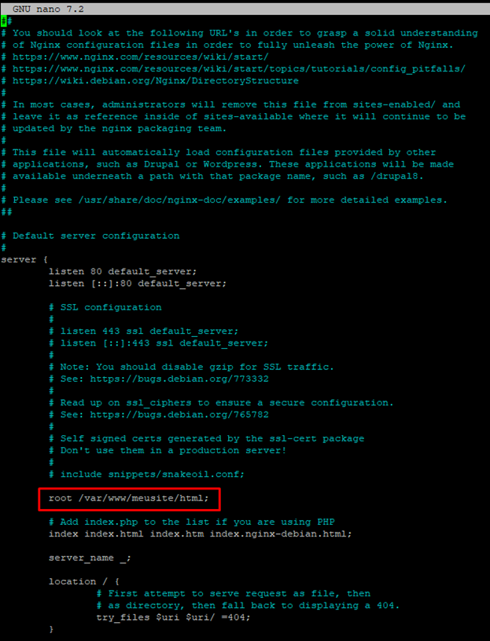

Reinicie o Nginx
```bash
sudo systemctl restart nginx
```
Assim, o Nginx está totalmente configurado!

# 2.4 - Automação no Systemd
Função systemd para garantir que o Nginx reinicie automaticamente se parar.
```bash
sudo nano /lib/systemd/system/nginx.service
```
Inserir na categoria *Service*

```bash
Restart=on-failure
RestartSec=5s
```
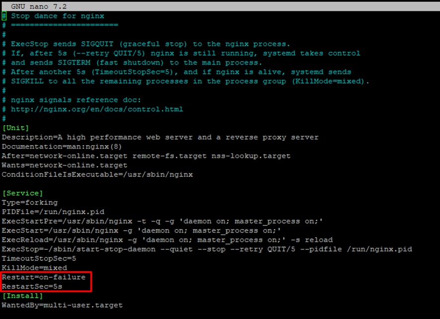

Recarregue o sistema usando
```bash
sudo systemctl daemon-reload
```

É uma boa ideia reiniciar o serviço do nginx para que as configurações de reinício atuem
```bash
sudo systemctl restart nginx
```
Para testar se está mesmo funcionando, é possível simular uma falha. Para isso é necessário utilizar uma série de comandos
Encontre o PID do processo(ID) na linha que mostra "master process"
```bash
ps aux | grep nginx
```
Mate o processo do Nginx utilizando o comando(insira o valor do PID):
```bash
sudo kill -9 <PID>”
```
# Etapa 3: Script de Monitoramento + Webhook
3.1 - Criar um script em Bash ou Python para monitorar a disponibilidade do site
Escolhendo criar em Bash, escreva
```bash
nano seu_script.sh
```
3.2 - Verificar se o site responde corretamente a uma requisição HTTP

```bash
“HTTP_STATUS=$(curl -s -o /dev/null -w "%{http_code}" -L --max-time "$TIMEOUT" --retry 3 --retry-max-time 30 "$URL")
CURL_EXIT_CODE=$?”
•	Este comando faz uma requisição HTTP ao site configurado na variável URL e captura o código de status de resposta.
•	--max-time "$TIMEOUT" define o tempo limite.
•	CURL_EXIT_CODE verifica se a requisição foi bem-sucedida (0 = sucesso).
```
3.2 - Criar logs das verificações em /var/log/monitoramento.log
```bash
LOG_FILE="/var/log/monitoramento.log
```
3.2 - Enviar uma notificação via Discord, Telegram ou Slack se detectar indisponibilidade. Escolhendo o Discord, é feito:

```bash
send_discord_notification() {
    local message="$1"
    ...
    curl -H "Content-Type: application/json" \
         -X POST \
         -d "$JSON_PAYLOAD" \
         "$DISCORD_WEBHOOK_URL" > /dev/null 2>&1
}
```
3.3 - Configurar o script para rodar automaticamente a cada 1 minuto usando cron ou systemd timers.
Para fazer a automação é necessário verificar se o script possui as permissões de execução:
```bash
chmod +x /caminho/completo/para/seu_script.sh
```

Abra o crontab
```bash
crontab -e
```
Na primeira vez, pode pedir pra escolher o editor(utilize o de sua preferência)
Utilize da sintaxe descrita abaixo
```bash
MIN HORA DIA MÊS DIA-SEMANA comando
```
Como é preciso colocar a verificação a cada 1 minuto, utilize:
```bash
* * * * * /caminho/completo/para/seu_script.sh
```
Salve e feche
Para facilitar o entendimento, se baseie nessa explicação
```bash
*     *     *   *   *     comando-a-ser-executado
│     │     │   │   │
│     │     │   │   └── Dia da semana (0 = domingo)
│     │     │   └────── Mês (1–12)
│     │     └────────── Dia do mês (1–31)
│     └─────────────── Hora (0–23)
└──────────────────── Minuto (0–59)
```

# Etapa 4: Automação e Testes
Automação: Ao inserir no crontab, ele já está automatizado para executar a cada 1 minuto

Testes:
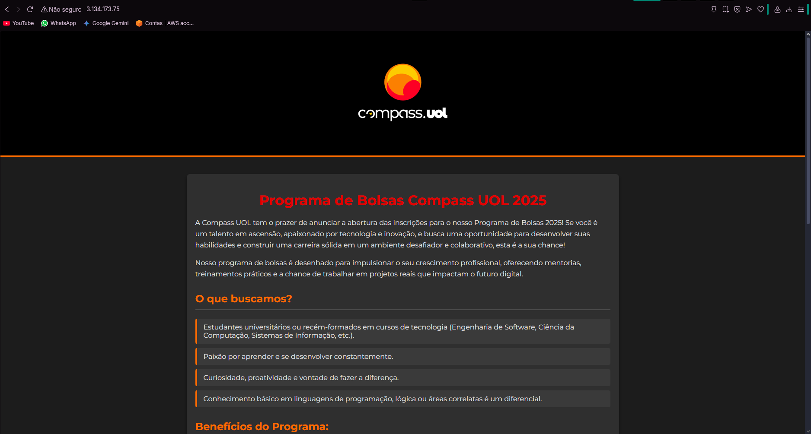


Recebida notificação de site online e offline 
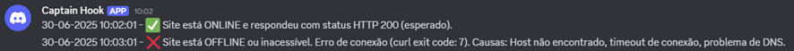

Ao dar stop no Nginx para testar mensagem de erro
```bash

```
Dar stop no Nginx para testar a mensagem de erro
```bash
sudo systemctl stop nginx
```
Para iniciar novamente
```bash
sudo systemctl start nginx
```

#!/bin/bash

URL="hotmail.com"
TIMEOUT=10
EXPECTED_STATUS=200
DISCORD_WEBHOOK_URL="Sua URL aqui"
LOG_FILE="/var/log/monitoramento.log"

TIMESTAMP=$(date +"%d-%m-%Y %H:%M:%S")
```

```bash
*     *     *   *   *     comando-a-ser-executado
│     │     │   │   │
│     │     │   │   └── Dia da semana (0 = domingo)
│     │     │   └────── Mês (1–12)
│     │     └────────── Dia do mês (1–31)
│     └─────────────── Hora (0–23)
└──────────────────── Minuto (0–59)
```


