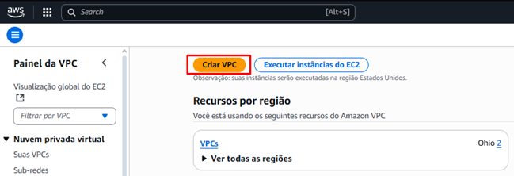

# Projeto Linux e AWS Compass UOL 2025
Projeto em Linux com o intuito fazer um script que verifique se um site está online e notifique através do Discord/Telegram, criar uma página HTML simples e usar o NGINX para armazenar

* Etapa 1: Configuração do Ambiente
* Etapa 2: Configuração do Servidor Web
* Etapa 3: Script de Monitoramento + Webhook
* Etapa 4: Testes e Documentação


# Etapa 1: Configuração do Ambiente
1.1 - Criação da VPC


Para conseguir a configuração das 2 sub redes públicas e privadas, é necessário seguir as mesmas configurações das imagens, após, basta pressionar o botão Criar VPC


Para a criação do Gateway, basta entrar na aba de Gateway e Clicar no botão de criação


1.2 - Criação de uma instância EC2 na AWS
Basta entrar na aba EC2 e clicar no botão de executar instância


Seleciona o sistema operacional descrito na atividade


Para instalar a sub rede criada anteriormente, basta clicar no botão de editar em “Configurações de rede”

Será necessário selecionar a VPC criada, uma das sub redes públicas e atribuir IP público automaticamente


Para permitir o tráfego HTTP(80) e SSH(22) é necessário adicionar uma nova regra e configurando as duas, uma para SSH e outra para HTTP, utilize das mesmas opções da imagem.


1.3 – Acessar instância via SSH
Para acessar via SSH, foi utilizado o programa PuTTY, é necessário colocar o IP atribuído a instância


Após, é necessário navegar até a opção SSH, Auth e Credentials. Na aba Credentials, você vai clicar em Browse na primeira opção e inserir a key privada, logo, basta clicar em Open


# Etapa 2: Instalação e Configuração do Servidor Web

Nessa etapa foi instalado e configurado o servidor web Nginx na máquina virtual Ubuntu 22.04. Também foi criada uma página HTML personalizada para ser servida pelo Nginx, contendo informações sobre o projeto. E foi criado um serviço systemd para garantir que o Nginx reinicie automaticamente após 3 minutos se parar.

## 1. Instalação e verificação do Nginx

### 1.1. Atualização dos pacotes do sistema

```bash
sudo apt-get update
```
### 1.2. Instalação do NGINX

```bash
sudo apt-get install nginx
```

Inicie o nginx
```bash
sudo systemctl start nginx
```
Verifique o stauts para ver se está ok
```bash
sudo systemctl status nginx
```
# 2.2 - Criar uma página HTML simples para ser exibida pelo servidor.
Criar uma nova pasta para o novo site

```bash
mkdir -p /var/www/meusite/html
```
Criar o arquivo HTML na nova pasta
```bash
nano /var/www/meusite/html/index.html
```
Coloque o seu código HTML, após isso pressione CTRL + O, ENTER e CTRL+X. Tem como objetivo salvar e sair do editor de texto.

# 2.3 - Configurar o Nginx para servir a página corretamente.
Navegue até a pasta de configurações do Nginx

```bash
nano /etc/nginx/sites-available/default
```
Após localizar o comando root /var/www/html, altere para a pasta criada, nesse caso será  root /var/www/meusite/html


Reinicie o Nginx
```bash
sudo systemctl restart nginx
```
Assim, o Nginx está totalmente configurado!

# 2.4 - Automação no Systemd
Função systemd para garantir que o Nginx reinicie automaticamente se parar.
```bash
sudo nano /lib/systemd/system/nginx.service
```
Inserir na categoria *Service*

```bash
Restart=on-failure
RestartSec=5s
```


Recarregue o sistema usando
```bash
sudo systemctl daemon-reload
```

É uma boa ideia reiniciar o serviço do nginx para que as configurações de reinício atuem
```bash
sudo systemctl restart nginx
```
Para testar se está mesmo funcionando, é possível simular uma falha. Para isso é necessário utilizar uma série de comandos
Encontre o PID do processo(ID) na linha que mostra "master process"
```bash
ps aux | grep nginx
```
Mate o processo do Nginx utilizando o comando(insira o valor do PID):
```bash
sudo kill -9 <PID>”
```
# Etapa 3: Script de Monitoramento + Webhook
3.1 - Criar um script em Bash ou Python para monitorar a disponibilidade do site
Escolhendo criar em Bash, escreva
```bash
nano seu_script.sh
```
3.2 - Verificar se o site responde corretamente a uma requisição HTTP

```bash
“HTTP_STATUS=$(curl -s -o /dev/null -w "%{http_code}" -L --max-time "$TIMEOUT" --retry 3 --retry-max-time 30 "$URL")
CURL_EXIT_CODE=$?”
•	Este comando faz uma requisição HTTP ao site configurado na variável URL e captura o código de status de resposta.
•	--max-time "$TIMEOUT" define o tempo limite.
•	CURL_EXIT_CODE verifica se a requisição foi bem-sucedida (0 = sucesso).
```
3.2 - Criar logs das verificações em /var/log/monitoramento.log
```bash
LOG_FILE="/var/log/monitoramento.log
```
3.2 - Enviar uma notificação via Discord, Telegram ou Slack se detectar indisponibilidade. Escolhendo o Discord, é feito:

```bash
send_discord_notification() {
    local message="$1"
    ...
    curl -H "Content-Type: application/json" \
         -X POST \
         -d "$JSON_PAYLOAD" \
         "$DISCORD_WEBHOOK_URL" > /dev/null 2>&1
}
```
3.3 - Configurar o script para rodar automaticamente a cada 1 minuto usando cron ou systemd timers.
Para fazer a automação é necessário verificar se o script possui as permissões de execução:
```bash
chmod +x /caminho/completo/para/seu_script.sh
```

Abra o crontab
```bash
crontab -e
```
Na primeira vez, pode pedir pra escolher o editor(utilize o de sua preferência)
Utilize da sintaxe descrita abaixo
```bash
MIN HORA DIA MÊS DIA-SEMANA comando
```
Como é preciso colocar a verificação a cada 1 minuto, utilize:
```bash
* * * * * /caminho/completo/para/seu_script.sh
```
Salve e feche
Para facilitar o entendimento, se baseie nessa explicação
```bash
*     *     *   *   *     comando-a-ser-executado
│     │     │   │   │
│     │     │   │   └── Dia da semana (0 = domingo)
│     │     │   └────── Mês (1–12)
│     │     └────────── Dia do mês (1–31)
│     └─────────────── Hora (0–23)
└──────────────────── Minuto (0–59)
```

# Etapa 4: Automação e Testes
Automação: Ao inserir no crontab, ele já está automatizado para executar a cada 1 minuto

Testes:


Recebida notificação de site online e offline 


Ao dar stop no Nginx para testar mensagem de erro
```bash

```
Dar stop no Nginx para testar a mensagem de erro
```bash
sudo systemctl stop nginx
```
Para iniciar novamente
```bash
sudo systemctl start nginx
```

#!/bin/bash

URL="hotmail.com"
TIMEOUT=10
EXPECTED_STATUS=200
DISCORD_WEBHOOK_URL="Sua URL aqui"
LOG_FILE="/var/log/monitoramento.log"

TIMESTAMP=$(date +"%d-%m-%Y %H:%M:%S")


```bash
*     *     *   *   *     comando-a-ser-executado
│     │     │   │   │
│     │     │   │   └── Dia da semana (0 = domingo)
│     │     │   └────── Mês (1–12)
│     │     └────────── Dia do mês (1–31)
│     └─────────────── Hora (0–23)
└──────────────────── Minuto (0–59)
```


# Etapa 1: Configuração do Ambiente

### 1.1 – Criação da VPC



Para conseguir a configuração das 2 sub-redes públicas e privadas, é necessário seguir as mesmas configurações das imagens abaixo. Após isso, pressione o botão Criar VPC:


Explicando o código completo:

```bash
#!/bin/bash

URL="Sua_URL"
TIMEOUT=10
EXPECTED_STATUS=200
DISCORD_WEBHOOK_URL="Seu_Link_Webhook"
LOG_FILE="/var/log/monitoramento.log"

TIMESTAMP=$(date +"%d-%m-%Y %H:%M:%S")
```

`URL`: O endereço do site a ser monitorado.
`TIMEOUT: O tempo máximo, em segundos, que o curl aguardará por uma resposta.

`EXPECTED_STATUS`: O código de status HTTP esperado para considerar o site online (neste caso, 200 OK).

`DISCORD_WEBHOOK_URL`: O URL do webhook do Discord para onde as notificações serão enviadas.

`LOG_FILE`: O caminho completo para o arquivo de log onde os registros das verificações serão salvos.

`TIMESTAMP`: Captura a data e hora atual no formato "DD-MM-AAAA HH:MM:SS" para ser usada nos logs e notificações.

==========================================================

```bash
send_discord_notification() {
    local message="$1" 

    JSON_PAYLOAD=$(cat <<EOF
{
  "content": "${TIMESTAMP} - ${message}"
}
EOF
)

    curl -H "Content-Type: application/json" \
         -X POST \
         -d "$JSON_PAYLOAD" \
         "$DISCORD_WEBHOOK_URL" > /dev/null 2>&1
}
```

`local message="$1"`: Declara uma variável local message e atribui a ela o primeiro argumento passado para a função.

`JSON_PAYLOAD`: Cria um payload JSON que será enviado ao Discord. O campo content inclui o timestamp e a mensagem fornecida.

`curl -H "Content-Type`: application/json" -X POST -d "$JSON_PAYLOAD" "$DISCORD_WEBHOOK_URL" > /dev/null 2>&1: Este comando curl envia o payload JSON para o Discord webhook URL.

`-H "Content-Type: application/json"`: Define o cabeçalho HTTP para indicar que o corpo da requisição é JSON.

`-X POST`: Especifica que a requisição é do tipo POST.

`-d "$JSON_PAYLOAD"`: Inclui os dados JSON como corpo da requisição.

`> /dev/null 2>&1`: Redireciona a saída padrão e de erro do curl para /dev/null, evitando que ele imprima qualquer coisa no terminal.

=================================================================

```bash
echo "--- Verificação iniciada em: $TIMESTAMP ---" >> "$LOG_FILE"
echo "Verificando a disponibilidade HTTP de: $URL" >> "$LOG_FILE"
echo "Tempo limite: $TIMEOUT segundos" >> "$LOG_FILE"
echo "Status HTTP esperado: $EXPECTED_STATUS" >> "$LOG_FILE"
echo "--------------------------------------------------" >> "$LOG_FILE"
```

`echo`: adiciona informações iniciais sobre a verificação no arquivo de log ($LOG_FILE)

`>>`: anexa o texto ao final do arquivo, sem sobrescrever o conteúdo existente. Isso cria um registro cronológico de cada execução do script.

====================================================================

```bash
HTTP_STATUS=$(curl -s -o /dev/null -w "%{http_code}" -L --max-time "$TIMEOUT" --retry 3 --retry-max-time 30 "$URL")
CURL_EXIT_CODE=$?
```

Utilizando o comando curl, ocorre a verificação principal:

`-s`: Modo silencioso, suprime a barra de progresso e mensagens de erro do curl.

`-o /dev/null`: Descarta a saída do corpo da resposta HTTP.

`-w "%{http_code}"`: Faz com que o curl imprima apenas o código de status HTTP da resposta.

`-L`: Segue redirecionamentos HTTP.

`--max-time "$TIMEOUT"`: Define o tempo máximo, em segundos, para a operação completa.

`--retry 3`: Tenta a conexão até 3 vezes em caso de falha temporária.

`--retry-max-time 30`: Define o tempo máximo total para todas as tentativas de reconexão.

`"$URL"`: A URL do site a ser verificado.

`HTTP_STATUS=$()`: A saída do comando curl (o código de status HTTP) é capturada e armazenada na variável HTTP_STATUS.

`CURL_EXIT_CODE=$?`: A variável especial $? captura o código de saída do último comando executado (curl, neste caso). Um código de saída 0 geralmente indica sucesso.

================================

```bash
if [ "$CURL_EXIT_CODE" -eq 0 ]; then
    if [ "$HTTP_STATUS" -eq "$EXPECTED_STATUS" ]; then
        MESSAGE="✅ Site está ONLINE e respondeu com status HTTP $HTTP_STATUS (esperado)."
        send_discord_notification "$MESSAGE" 3066993   
    fi
else
    MESSAGE="❌ Site está OFFLINE ou inacessível. Erro de conexão (curl exit code: $CURL_EXIT_CODE)."
    MESSAGE+=" Causas: Host não encontrado, timeout de conexão, problema de DNS."
    send_discord_notification "$MESSAGE" 15158332 
fi
```

`if [ "$CURL_EXIT_CODE" -eq 0 ]`; then: Verifica se o curl foi executado com sucesso (código de saída 0).

`if [ "$HTTP_STATUS" -eq "$EXPECTED_STATUS" ]; then`: Se o curl foi bem-sucedido, verifica se o HTTP_STATUS é igual ao EXPECTED_STATUS.

Se sim, define a MESSAGE de sucesso e chama send_discord_notification com essa mensagem. O número 3066993 parece ser um valor adicional que não está sendo usado na função send_discord_notification como está definida, o que pode indicar um resquício de uma versão anterior ou um erro.

`else`: Se o CURL_EXIT_CODE não for 0 (indicando um erro de conexão do curl), define uma MESSAGE de erro detalhada, mencionando possíveis causas e o código de saída do curl. Em seguida, chama send_discord_notification com essa mensagem. Assim como antes, o número 15158332 também não é utilizado pela função atual.

```bash
echo "$MESSAGE" >> "$LOG_FILE" 
echo "--------------------------------------------------" >> "$LOG_FILE"
echo " Verificação finalizada em: $TIMESTAMP " >> "$LOG_FILE"
```
Por fim, este bloco adiciona a mensagem resultante da verificação ($MESSAGE) e uma linha final ao arquivo de log, indicando que a verificação foi concluída, juntamente com o timestamp.
