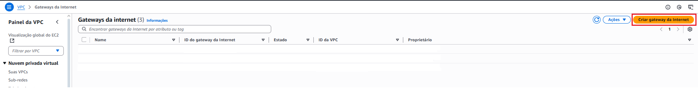
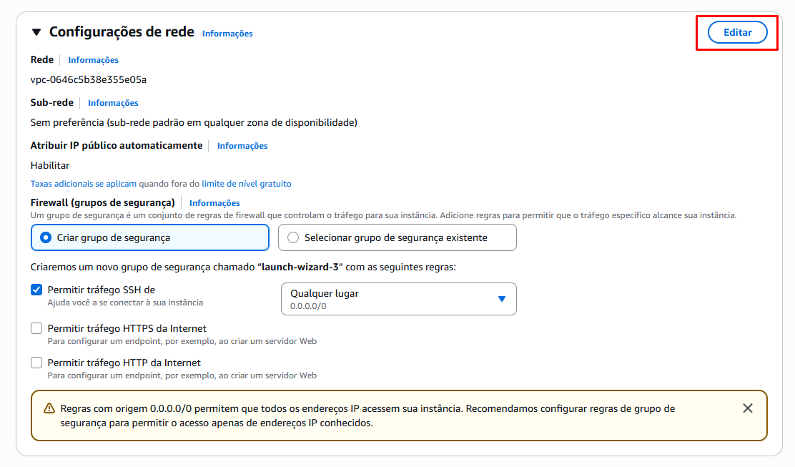
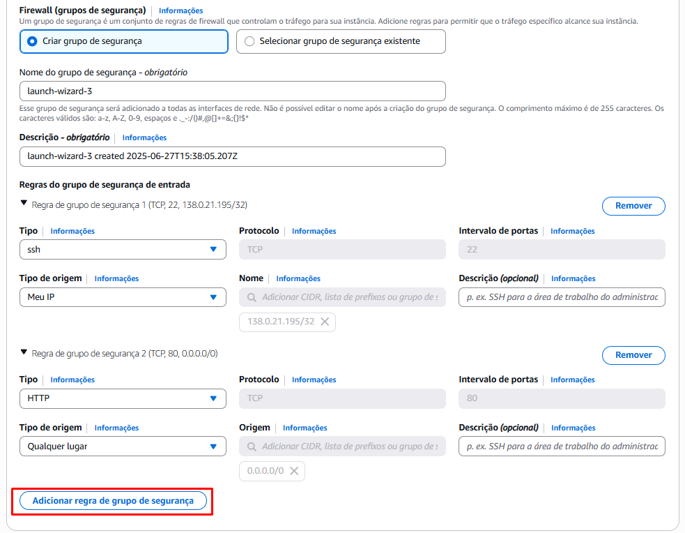
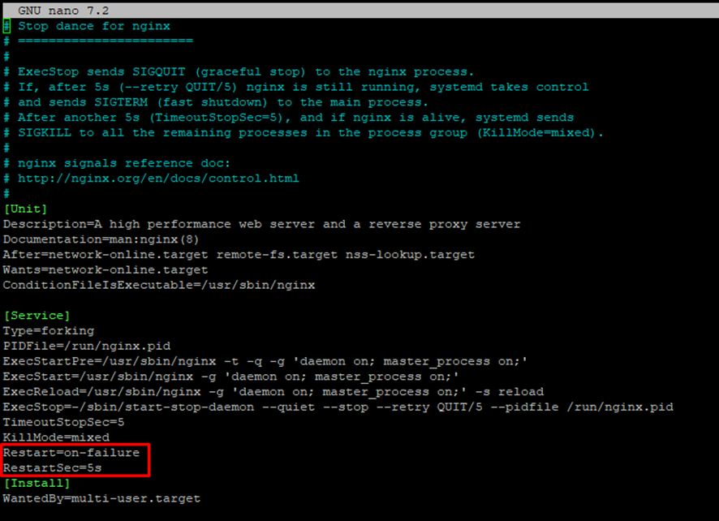
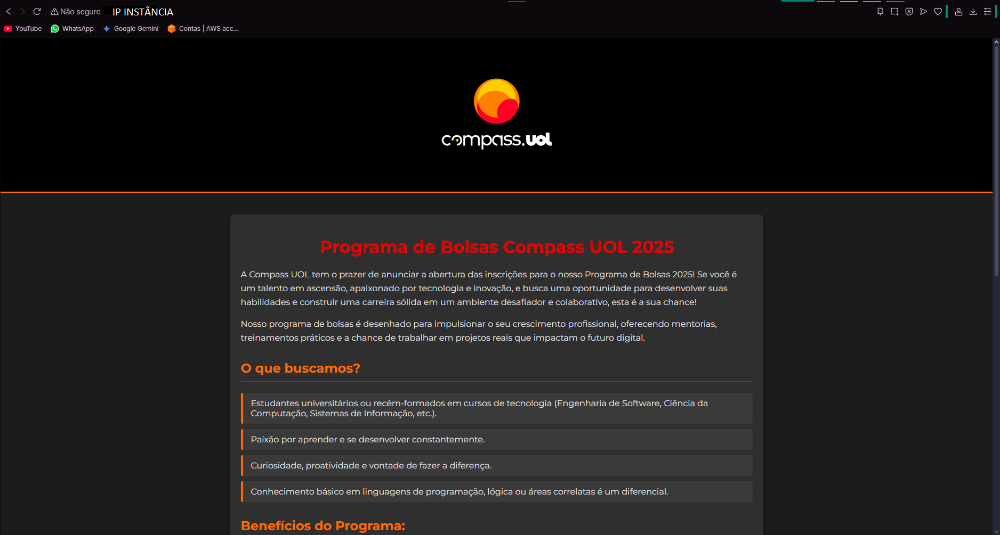
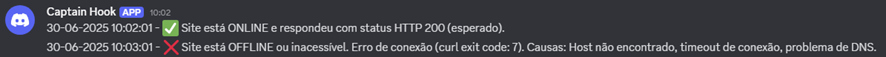

# Projeto Linux e AWS Compass UOL 2025

Projeto desenvolvido em ambiente Linux com o objetivo de:

- Criar um script que verifica se um site está online;
- Notificar via Discord/Telegram em caso de instabilidade;
- Criar uma página HTML simples servida por NGINX;
- Automatizar os serviços com `cron` e `systemd`.

## Sumário

- [Etapa 1: Configuração do Ambiente](#etapa-1-configuração-do-ambiente)
- [Etapa 2: Servidor Web (NGINX)](#etapa-2-instalação-e-configuração-do-servidor-web)
- [Etapa 3: Script de Monitoramento](#etapa-3-script-de-monitoramento--webhook)
- [Etapa 4: Testes e Documentação](#etapa-4-automacao-e-testes)

---

## Etapa 1: Configuração do Ambiente

### 1.1 - Criação da VPC


Configure duas sub-redes (pública e privada) conforme as imagens abaixo, depois clique em "Criar VPC":

&#x20;


Para o Gateway basta entrar na aba de Gateway(localizado no canto esquerdo) e Clicar no botão de criação:&#x20;

### 1.2 - Criação de Instância EC2

Acesse a aba EC2 e clique em "Executar Instância":


Selecione o sistema operacional conforme instruções:&#x20;

Para instalar a sub rede criada anteriormente, basta clicar no botão de editar em “Configurações de rede”:

Será necessário selecionar a VPC criada, uma das sub redes públicas e atribuir IP público automaticamente:

&#x20;


Para permitir o tráfego HTTP(80) e SSH(22) é necessário adicionar uma nova regra e configurando as duas, uma para SSH e outra para HTTP, utilize das mesmas opções da imagem:&#x20;


### 1.3 - Acesso via SSH (PuTTY)


Insira o IP público da instância:&#x20;


Configure o caminho da chave privada. É necessário navegar até a opção SSH, Auth e Credentials. Na aba Credentials, você vai clicar em Browse na primeira opção e inserir a key privada, logo, basta clicar em Open :&#x20;


---

## Etapa 2: Instalação e Configuração do Servidor Web

Nessa etapa será instalado e configurado o servidor web Nginx na máquina virtual Ubuntu 22.04. Também será criada uma página HTML personalizada para ser servida pelo Nginx, contendo informações sobre o projeto. E por fim será criado um serviço systemd para garantir que o Nginx reinicie automaticamente se parar.

### 2.1 - Instalação do NGINX

Primeiramente, realize a atualização dos pacotes do sistema
```bash
sudo apt-get update
```
Faça a instalação do Nginx
```bash
sudo apt-get install nginx
```
Inicie o Nginx
```bash
sudo systemctl start nginx
```
Verifique o status para ver se está ativado
```bash
sudo systemctl status nginx
```

### 2.2 - Criar página HTML personalizada

Crie uma pasta para o novo site
```bash
mkdir -p /var/www/meusite/html
```
Agora crie o arquivo HTML e insira o seu código
```bash
nano /var/www/meusite/html/index.html
```

### 2.3 - Configuração do NGINX

Edite o arquivo de configuração:
```bash
nano /etc/nginx/sites-available/default
```
Localize o comando marcado


Altere o caminho do `root` para a nova pasta:


Reinicie o NGINX:

```bash
sudo systemctl restart nginx
```

### 2.4 - Systemd para reinício automático

Função systemd para garantir que o Nginx reinicie automaticamente se parar.
```bash
sudo nano /lib/systemd/system/nginx.service
```

Adicione na categoria Service:

```bash
Restart=on-failure
RestartSec=5s
```

Finalize com:

```bash
sudo systemctl daemon-reload
sudo systemctl restart nginx
```



### Para testar:

Para verificar se está mesmo funcionando, é possível simular uma falha. Para isso é necessário utilizar uma série de comandos. Encontre o PID do processo(ID) na linha que mostra "master process"
```bash
ps aux | grep nginx
```

Mate o processo do Nginx utilizando o comando(insira o valor do PID):
```bash
sudo kill -9 <PID>
```

---

## Etapa 3: Script de Monitoramento + Webhook

### 3.1 - Criação do Script Bash

```bash
nano seu_script.sh
```

### 3.2 - Verificar se o site responde corretamente a uma requisição HTTP

```bash
“HTTP_STATUS=$(curl -s -o /dev/null -w "%{http_code}" -L --max-time "$TIMEOUT" --retry 3 --retry-max-time 30 "$URL")
CURL_EXIT_CODE=$?”
```
Este comando faz uma requisição HTTP ao site configurado na variável URL e captura o código de status de resposta.
--max-time "$TIMEOUT" define o tempo limite.
CURL_EXIT_CODE verifica se a requisição foi bem-sucedida (0 = sucesso).


### 3.2 - Criar logs das verificações em /var/log/monitoramento.log
```bash
LOG_FILE="/var/log/monitoramento.log
```

### 3.2 - Enviar uma notificação via Discord, Telegram ou Slack se detectar indisponibilidade.

```bash
send_discord_notification() {
    local message="$1"
    JSON_PAYLOAD=$(cat <<EOF
{
  "content": "${TIMESTAMP} - ${message}"
}
EOF
)
    curl -H "Content-Type: application/json" \
         -X POST \
         -d "$JSON_PAYLOAD" \
         "$DISCORD_WEBHOOK_URL" > /dev/null 2>&1
}
```


### 3.3 - Configurar o script para rodar automaticamente a cada 1 minuto usando cron ou systemd timers.

O script precisa ter permissões de execução, pra isso, insira:

```bash
chmod +x /caminho/para/seu_script.sh
```

Abra o crontab
```bash
crontab -e
```

Para a verificação a cada 1 minuto, insira:

```bash
* * * * * /caminho/para/seu_script.sh
```
Para facilitar o entedimento, considere:
```bash
*     *     *   *   *     comando-a-ser-executado
│     │     │   │   │
│     │     │   │   └── Dia da semana (0 = domingo)
│     │     │   └────── Mês (1–12)
│     │     └────────── Dia do mês (1–31)
│     └─────────────── Hora (0–23)
└──────────────────── Minuto (0–59)
```

---

## Etapa 4: Automação e Testes

Com o `cron` configurado, o script é executado automaticamente a cada minuto.

### Testes Visuais:

- Visualização da página:&#x20;


- Notificação recebida via Discord:&#x20;


- Interrupção do NGINX para testar a falha:

```bash
sudo systemctl stop nginx
```

- Iniciação do NGINX:

```bash
sudo systemctl start nginx
```

---
### Explicando o código completo:

```bash
#!/bin/bash

URL="Sua_URL"
TIMEOUT=10
EXPECTED_STATUS=200
DISCORD_WEBHOOK_URL="Seu_Link_Webhook"
LOG_FILE="/var/log/monitoramento.log"

TIMESTAMP=$(date +"%d-%m-%Y %H:%M:%S")
```

`#!/bin/bash`: Esta é a linha conhecida como shebang. Ela informa ao sistema operacional qual interpretador de comandos deve ser usado para executar este script. No seu caso, ele diz: "Use o Bash (Bourne Again SHell) que está localizado em /bin/bash para rodar este arquivo". Isso garante que o script funcione corretamente, mesmo que o usuário tenha um shell padrão diferente.

`URL`: O endereço do site a ser monitorado.
`TIMEOUT: O tempo máximo, em segundos, que o curl aguardará por uma resposta.

`EXPECTED_STATUS`: O código de status HTTP esperado para considerar o site online (neste caso, 200 OK).

`DISCORD_WEBHOOK_URL`: O URL do webhook do Discord para onde as notificações serão enviadas.

`LOG_FILE`: O caminho completo para o arquivo de log onde os registros das verificações serão salvos.

`TIMESTAMP`: Captura a data e hora atual no formato "DD-MM-AAAA HH:MM:SS" para ser usada nos logs e notificações.

---

```bash
send_discord_notification() {
    local message="$1" 

    JSON_PAYLOAD=$(cat <<EOF
{
  "content": "${TIMESTAMP} - ${message}"
}
EOF
)

    curl -H "Content-Type: application/json" \
         -X POST \
         -d "$JSON_PAYLOAD" \
         "$DISCORD_WEBHOOK_URL" > /dev/null 2>&1
}
```

`local message="$1"`: Declara uma variável local message e atribui a ela o primeiro argumento passado para a função.

`JSON_PAYLOAD`: Cria um payload JSON que será enviado ao Discord. O campo content inclui o timestamp e a mensagem fornecida.

`curl -H "Content-Type`: application/json" -X POST -d "$JSON_PAYLOAD" "$DISCORD_WEBHOOK_URL" > /dev/null 2>&1: Este comando curl envia o payload JSON para o Discord webhook URL.

`-H "Content-Type: application/json"`: Define o cabeçalho HTTP para indicar que o corpo da requisição é JSON.

`-X POST`: Especifica que a requisição é do tipo POST.

`-d "$JSON_PAYLOAD"`: Inclui os dados JSON como corpo da requisição.

`> /dev/null 2>&1`: Redireciona a saída padrão e de erro do curl para /dev/null, evitando que ele imprima qualquer coisa no terminal.

---

```bash
echo "--- Verificação iniciada em: $TIMESTAMP ---" >> "$LOG_FILE"
echo "Verificando a disponibilidade HTTP de: $URL" >> "$LOG_FILE"
echo "Tempo limite: $TIMEOUT segundos" >> "$LOG_FILE"
echo "Status HTTP esperado: $EXPECTED_STATUS" >> "$LOG_FILE"
echo "--------------------------------------------------" >> "$LOG_FILE"
```

`echo`: adiciona informações iniciais sobre a verificação no arquivo de log ($LOG_FILE)

`>>`: anexa o texto ao final do arquivo, sem sobrescrever o conteúdo existente. Isso cria um registro cronológico de cada execução do script.

---

```bash
HTTP_STATUS=$(curl -s -o /dev/null -w "%{http_code}" -L --max-time "$TIMEOUT" --retry 3 --retry-max-time 30 "$URL")
CURL_EXIT_CODE=$?
```

Utilizando o comando curl, ocorre a verificação principal:

`-s`: Modo silencioso, suprime a barra de progresso e mensagens de erro do curl.

`-o /dev/null`: Descarta a saída do corpo da resposta HTTP.

`-w "%{http_code}"`: Faz com que o curl imprima apenas o código de status HTTP da resposta.

`-L`: Segue redirecionamentos HTTP.

`--max-time "$TIMEOUT"`: Define o tempo máximo, em segundos, para a operação completa.

`--retry 3`: Tenta a conexão até 3 vezes em caso de falha temporária.

`--retry-max-time 30`: Define o tempo máximo total para todas as tentativas de reconexão.

`"$URL"`: A URL do site a ser verificado.

`HTTP_STATUS=$()`: A saída do comando curl (o código de status HTTP) é capturada e armazenada na variável HTTP_STATUS.

`CURL_EXIT_CODE=$?`: A variável especial $? captura o código de saída do último comando executado (curl, neste caso). Um código de saída 0 geralmente indica sucesso.

---

```bash
if [ "$CURL_EXIT_CODE" -eq 0 ]; then
    if [ "$HTTP_STATUS" -eq "$EXPECTED_STATUS" ]; then
        MESSAGE="✅ Site está ONLINE e respondeu com status HTTP $HTTP_STATUS (esperado)."
        send_discord_notification "$MESSAGE" 3066993   
    fi
else
    MESSAGE="❌ Site está OFFLINE ou inacessível. Erro de conexão (curl exit code: $CURL_EXIT_CODE)."
    MESSAGE+=" Causas: Host não encontrado, timeout de conexão, problema de DNS."
    send_discord_notification "$MESSAGE" 15158332 
fi
```

`if [ "$CURL_EXIT_CODE" -eq 0 ]`; then: Verifica se o curl foi executado com sucesso (código de saída 0).

`if [ "$HTTP_STATUS" -eq "$EXPECTED_STATUS" ]; then`: Se o curl foi bem-sucedido, verifica se o HTTP_STATUS é igual ao EXPECTED_STATUS.

Se sim, define a MESSAGE de sucesso e chama send_discord_notification com essa mensagem. O número 3066993 parece ser um valor adicional que não está sendo usado na função send_discord_notification como está definida, o que pode indicar um resquício de uma versão anterior ou um erro.

`else`: Se o CURL_EXIT_CODE não for 0 (indicando um erro de conexão do curl), define uma MESSAGE de erro detalhada, mencionando possíveis causas e o código de saída do curl. Em seguida, chama send_discord_notification com essa mensagem. Assim como antes, o número 15158332 também não é utilizado pela função atual.

```bash
echo "$MESSAGE" >> "$LOG_FILE" 
echo "--------------------------------------------------" >> "$LOG_FILE"
echo " Verificação finalizada em: $TIMESTAMP " >> "$LOG_FILE"
```
Por fim, este bloco adiciona a mensagem resultante da verificação ($MESSAGE) e uma linha final ao arquivo de log, indicando que a verificação foi concluída, juntamente com o timestamp.

---
> Documentação criada com base em experiência prática no uso de Linux, EC2, NGINX e automação com Shell Script. Projeto educacional para a Compass UOL 2025.

